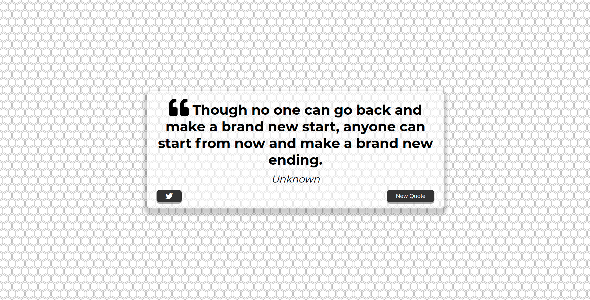

# Quote Generator

#Learned How To:

- Make an asynchronous fetch request to a REST API,
- Made a proxy API with Heroku to avoid CORS problems,

## Built With

- HTML
- CSS
- JS

### Usage

[Live Demo Link](https://ramon-carrillo.github.io/QuoteGenerator/)

## Author

👤 Ramon Carrillo

- GitHub: [@githubhandle](https://github.com/Ramon-Carrillo)
- Twitter: [@twitterhandle](https://twitter.com/ramon_de_NL)
- LinkedIn: [linkedin](https://www.linkedin.com/in/ramon-carrillo-54525a1ab/)

## Show your support

Give a ⭐️ if you like this project!

## Acknowledgments

One of the projects from JavaScript 20 Projects Course.
